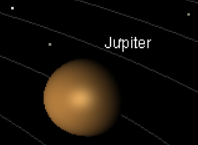
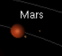
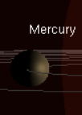
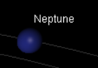
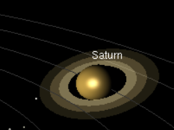
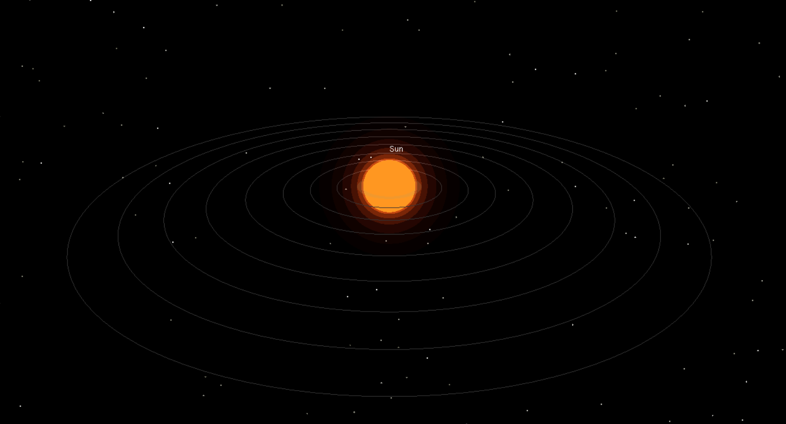
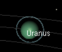
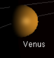

# 🌌 OpenGL Solar System Simulation

A 3D interactive Solar System simulation developed using **C, OpenGL, GLUT, and GLU**.

This project demonstrates fundamental computer graphics concepts through an interactive simulation of the Sun, eight planets, Earth's Moon, and Mars' moons. The simulation includes orbital motion, planetary rotation, camera controls, stars, orbit paths, labels, and visual effects.

---

## ✨ Features

- ☀️ 3D Sun with layered glow effect
- 🪐 Eight planets
- 🌍 Earth with Moon
- 🔴 Mars with Phobos and Deimos
- 💍 Saturn's ring system
- 💫 Uranus' ring system
- ⭐ 700 stars
- 🔄 Planetary orbital motion
- 🌀 Planetary self-rotation
- 🎥 Interactive 3D camera
- 🔍 Zoom in / out
- ⚡ Adjustable simulation speed
- ⏯️ Pause / Resume functionality
- 🏷️ Planet labels
- 📊 On-screen HUD
- 🛸 Real-time animation

---

## 🛠️ Technologies Used

- **C**
- **OpenGL**
- **GLUT / FreeGLUT**
- **GLU**
- **Math Library**

---

## 🎮 Controls

| Input | Action |
|---|---|
| 🖱️ Left Mouse Drag | Orbit camera |
| 🖱️ Scroll Wheel | Zoom in / out |
| **W** | Zoom in |
| **S** | Zoom out |
| **A** | Rotate camera left |
| **D** | Rotate camera right |
| **+ / =** | Increase simulation speed |
| **- / _** | Decrease simulation speed |
| **Space** | Pause / Resume |
| **ESC** | Exit |

---

# 📸 Screenshots

### 🌍 Earth and Moon


### Jupiter



### 🔴 Mars



### ☿ Mercury



### ♆ Neptune



### 💍 Saturn



### ☀️ Sun



### ♅ Uranus



### ♀ Venus



---

# 🎥 Demo Video

A demonstration video of the Solar System simulation is included in the `Demo` folder.

[▶️ Watch the Demo Video](Demo/Demo.mp4)

---

# 🌍 Project Overview

The simulation creates a three-dimensional representation of the Solar System using OpenGL. Each planet is rendered as a 3D object and placed at a different orbital distance from the Sun.

The planets continuously revolve around the Sun while also rotating around their own axes. Earth's Moon and Mars' moons are independently animated around their respective planets.

The application also provides an interactive camera system, allowing the user to explore the Solar System from different viewing angles and distances.

---

# 🪐 Planetary Systems

The simulation includes:

- ☀️ **Sun**
- ☿ **Mercury**
- ♀ **Venus**
- 🌍 **Earth**
  - 🌙 Moon
- 🔴 **Mars**
  - Phobos
  - Deimos
- ♃ **Jupiter**
- 💍 **Saturn**
- ♅ **Uranus**
- ♆ **Neptune**

---

# ⭐ Visual Effects

Several graphical effects are used to improve the appearance of the simulation:

- Star-filled space background
- Layered glowing Sun
- Planetary orbit lines
- Saturn's rings
- Uranus' rings
- Planet labels
- HUD information
- Dynamic camera movement
- Real-time animation

---

# 📁 Project Structure

```text
OpenGL-Solar-System-Simulation/
│
├── src/
│   └── solar_system.c
│
├── Screenshots/
│   ├── Earth_and_Moon.png
│   ├── Jupiter.png
│   ├── Mars.png
│   ├── Mercury.png
│   ├── Neptune.png
│   ├── Saturn.png
│   ├── Sun.png
│   ├── Uranus.png
│   └── Venus.png
│
├── Demo/
│   └── demo.mp4
│
└── README.md
```

---

# 💻 Source Code

The main source code is located at:

```text
src/solar_system.c
```

The project uses OpenGL's immediate-mode rendering along with GLUT and GLU for window management, interaction, and 3D graphics.

---

# 🎓 Project Information

**Project:** 3D Solar System Simulation  
**Course:** Computer Graphics  
**Language:** C  
**Graphics API:** OpenGL / GLUT / GLU

---

# 📚 Learning Objectives

This project demonstrates practical applications of:

- 3D object rendering
- Geometric transformations
- Translation and rotation
- Animation
- Camera manipulation
- User input handling
- OpenGL rendering
- Lighting and visual effects
- Hierarchical object movement

---

# 📄 License

This project is released under the **MIT License**.

See the `LICENSE` file for details.

---

## 👨‍💻 About

A Computer Graphics project created as an interactive 3D Solar System simulation using C and OpenGL.
